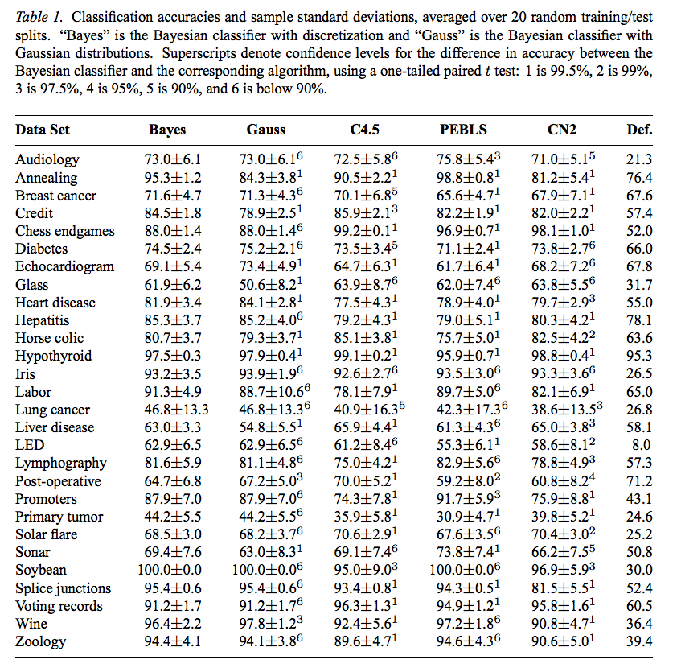

# Middle, and Diversity around Middle

Here's the great secret about optimization and data mining
- under the hood,  they share a lot of the same structures
- data mining divides up the world
- optimizers comment where to jump between the divisions.


So here we want to talk about the data and operations relevant to
columns and rows of data.


```
            {Clndrs Volume Hpx  Lbs-  Acc+   Model   origin  Mpg+}
            ------- ------ ---  ----  -----  ------  ------  ------
t1= {cells= {4      97     52   2130  24.6   82      2       40}}
t2= {cells= {4      97     54   2254  23.5   72      2       20}}
t3= {cells= {4      97     78   2188  15.8   80      2       30}}
t4= {cells= {4      151    90   2950  17.3   82      1       30}}
t5= {cells= {6      200    ?    2875  17     74      1       20}}
t6= {cells= {6      146    97   2815  14.5   77      3       20}}
t7= {cells= {8      267    125  3605  15     79      1       20}}
t9= {cells= {8      307    130  4098  14     72      1       10}}
```


Things to watch for are 
- table, row, column (attribute, feature, goal)
- nominal, ratio, SYM, NUM, SOME
- mid, mean, median, mode
- div, entropy, standard deviation, IQR
- parametric (normal, Gaussian), non-parametric 
  (reservoir sampling)
- multi-goal, many-goal
  - binary, continuous domination (cdom, Ziztler)
- distance: Euclidean, $p$


## Kinds of of Attributes (aka Columns, Variables, Features)


|  | Nominal | Ordinal | Interval | Ratio |
|:--:|:--------:|:----------:|:----------:|:-------:|
|used&nbsp;in&nbsp;this&nbsp;class|y|n|        n |  y    | 
|aka| SYMbolic | | | NUMeric|
|e.g.| eye&nbsp;color,&nbsp;genotype&nbsp;|small,medium |temperature  | weight,length| 
|compare&nbsp;${\neq},=$, | Y |Y |Y | Y |
|order,&nbsp;sort&nbsp;<, > | N | Y | Y | Y |
|+&nbsp;or&nbsp;- | N | N |Y | Y|
|* &nbsp;or&nbsp;/ | N | N |N | Y|
|centrality(mid) | mode<br>(most common symbol)| mode | (1) mean  $(\sum_i x_i)/n$<br>(2) median (50th percentile) | mean,median|
|diversity<br>(div)  | entropy<br> (effort to recreate signal)<br> $e=-\sum_i(p_i\times log_2(p_i))$    | entropy | (1) standard deviation<br> (distances from the  mean) <br> $\sigma = \sqrt{\frac{\sum_i(x_i-\mu)^2}{n-1}}$<br>(2) IQR: inter-quartile range<br>(75th-25th) percentile | standard deviation|

### Class SYM
Here are some classes to compute the important parts of the above:

```lua
SYM = obj"SYM"
function SYM.new(i) --> SYM; constructor
  i.n   = 0
  i.has = {}
  i.most, i.mode = 0,nil end

function SYM.add(i,x) --> nil;  update counts of things seen so far
  if x ~= "?" then 
   i.n = i.n + 1 
   i.has[x] = 1 + (i.has[x] or 0)
   if i.has[x] > i.most then
     i.most,i.mode = i.has[x], x end end end 

function SYM.mid(i,x) return i.mode end --> n; return the mode

function SYM.div(i,x) --> n; return the entropy, calculated via Shannon entropy
  local function fun(p) return p*math.log(p,2) end
  local e=0; for _,n in pairs(i.has) do e = e + fun(n/i.n) end 
  return -e end
```

X(entropy.png){ width=400px }

By the way, to understand SYM.div (entropy), think of it as
- the effort required by binary chop to find clumps of a signal hiding in a stream of noise


e.g. in a vector of size 4,
- nazis have a "1" near one end
- and England are all the other bits
- This means that 1/4% of the time we need to do binary chops to find nazies (i.e. $p_{\mathit{nazis}}=.25$)
- and 75% if the time we need to binary chops to find Englad (i.e. $p_{\mathit{england}}$=.75)
- Each chop will cost us $log2(p_i)$ so the total effort is $e=-\sum_i(p_i\times log_2(p_i))$ 
  - By convention, we  add a minus sign at the front (else all entropies will be negative).


(Actually, formally entropy has other definition: 
- The entropy of a discrete random variable is a lower bound on the expected number of bits required to transfer the result of the random variable.
- Also, entropy of continuous distributions is defined, but we do not use that in this subject.)


### Class NUM


```lua
NUM = obj"NUM"
function NUM.new(i) --> NUM;  constructor; 
  i.n, i.mu, i.m2 = 0, 0, 0
  i.lo, i.hi = math.huge, -math.huge end


function NUM.add(i,n) --> NUM; add `n`, update lo,hi and stuff needed for standard deviation
  if n ~= "?" then
    i.n  = i.n + 1
    local d = n - i.mu
    i.mu = i.mu + d/i.n
    i.m2 = i.m2 + d*(n - i.mu)
    i.lo = math.min(n, i.lo)
    i.hi = math.max(n, i.hi) end end


function NUM.mid(i,x) return i.mu end --> n; return mean


function NUM.div(i,x)  --> n; return standard deviation using Welford's algorithm http://t.ly/nn_W
    return (i.m2 <0 or i.n < 2) and 0 or (i.m2/(i.n-1))^0.5  end
```


### So-called "Normal" Curves
If we are talking standard deviation, then we had better talk about normal curves.


The French mathematician Abraham de Moivre [^deMo1718]
  notes that probabilities associated with discretely 
  generated random variables (such as are obtained by flipping a coin or rolling a die) can 
  be approximated by the area under the graph of an exponential function.


This function was generalized by  Laplace[^Lap1812] 
  into the first central limit theorem, which proved that probabilities for almost 
  all independent and identically distributed random variables converge rapidly 
  (with sample size) to the area under an exponential function—that is, to a normal 
  distribution.


This function was extended, extensively by Gauss. Now its a curve with an area under the curve of one.
  As standard deviation shrinks, the curve spikes upwards.


XXX[](=center src="/etc/img/norm.png" align=right width=600></p>


To sample from a normal curve
from a Gaussian with mean `mu` and diversity `sd`


$$  mu + sd * sqrt(-2*log(random)) * cos(2*pi*random) $$


_Beware:_
Not all things are normal Gaussians. 

 If you want to get fancy, you can use Weibull functions
to make a variety of shapes (just by adjusting $\lambda,k$):


X(https://github.com/timm/tested/blob/9a4e952aac75352ddc87ae17bd0881d6a5c93b62/etc/img/weibulleq.png) 


Or you could forget all about parametric assumptions.
Many things get improved by going beyond the Gaussian guess [^dou95]:
Not everything is best represented by a smooth curve with one peek that is symmetrical around that peek:


X(https://github.com/txt/fss17/raw/master/img/notnorm8.png)


To go fully non-parametric, use reservoir sampling (below). Then to sample, grab three numbers $a,b,c$ and use $x=a+f\times(b-c)$ for some small $f$ (say $f=0.1$).


All that said, Gaussians take up far less space and are very easy to update. So all engineers should know their gaussians.


# Bayes

A Bayes classifier is a simple statistical-based learning scheme.

Advantages:

+ Tiny memory footprint
+ Fast training, fast learning
+ Simplicity
+ Often works surprisingly well

Assumptions

+ Learning is done best via statistical modeling
+ Attributes are
    + equally important
    + statistically independent (given the class value)
    + Which  means that knowledge about the value of a particular attribute doesn't tell us anything about the value of another attribute (if the class is known)
	
Although based on assumptions that are almost never correct, this scheme works well in practice:

+ <em>Pedro Domingos and Michael Pazzani. 1997. [On the Optimality of the Simple Bayesian Classifier under Zero-One Loss](http://goo.gl/vURpPu). Mach. Learn. 29, 2-3 (November 1997), 103-130</em>



\newpage

# Example 

\footnotesize

```
outlook  temperature  humidity   windy   play
-------  -----------  --------   -----   ----
rainy    cool        normal    TRUE    no
rainy    mild        high      TRUE    no
sunny    hot         high      FALSE   no
sunny    hot         high      TRUE    no
sunny    mild        high      FALSE   no
overcast cool        normal    TRUE    yes
overcast hot         high      FALSE   yes
overcast hot         normal    FALSE   yes
overcast mild        high      TRUE    yes
rainy    cool        normal    FALSE   yes
rainy    mild        high      FALSE   yes
rainy    mild        normal    FALSE   yes
sunny    cool        normal    FALSE   yes
sunny    mild        normal    TRUE    yes%%
```

\normalsize

This data can be summarized as follows:

    
               Outlook            Temperature           Humidity
    ====================   =================   =================
              Yes    No            Yes   No            Yes    No
    Sunny       2     3     Hot     2     2    High      3     4
    Overcast    4     0     Mild    4     2    Normal    6     1
    Rainy       3     2     Cool    3     1
              -----------         ---------            ----------
    Sunny     2/9   3/5     Hot   2/9   2/5    High    3/9   4/5
    Overcast  4/9   0/5     Mild  4/9   2/5    Normal  6/9   1/5
    Rainy     3/9   2/5     Cool  3/9   1/5
    
                Windy        Play
    =================    ========
          Yes     No     Yes   No
    False 6      2       9     5
    True  3      3
          ----------   ----------
    False  6/9    2/5   9/14  5/14
    True   3/9    3/5


So, what happens on a new day:

    Outlook       Temp.         Humidity    Windy         Play
    Sunny         Cool          High        True          ?%%

First find the likelihood of the two classes

+ For "yes" = 2/9 * 3/9 * 3/9 * 3/9 * 9/14 = 0.0053
+ For "no" = 3/5 * 1/5 * 4/5 * 3/5 * 5/14 = 0.0206

Conversion into a probability by normalization:

+ P("yes") = 0.0053 / (0.0053 + 0.0206) = 0.205
+ P("no") = 0.0206 / (0.0053 + 0.0206) = 0.795

So, we aren't playing golf today.

\newpage

# Bayes' rule

More generally, the above is just an application of Bayes' Theorem.

Probability of event H given evidence E:


$$P(H|E) = \frac{P(H) \times \sum_x P(E_x|H)}{P(E)} $$

A _priori probability_ of $H$ is $P(H)$.

+ Probability of event before evidence has been seen

A _posteriori probability_ of $H$ is  $P(H|E) $

+ Probability of event after evidence has been seen

Classification learning: what's the probability of the class given an instance?

+ Evidence E = instance
+ Event H = class value for instance

Naive Bayes assumption: evidence can be split into independent parts (i.e. attributes of instance!

$$ P(H|E)  = \frac{   \left( P(E_1 | H )* P(E_2 | H ) * ....  * P(E_n | H )\right) \times P(H) }{P(E)} $$

We used this above. Here's our evidence:

    Outlook       Temp.         Humidity    Windy         Play
    Sunny         Cool          High        True          ?

Here's the probability for "yes":

    P( yes | E] = P(Outlook     = Sunny | yes) *
                   P(Temperature = Cool  | yes) *
                   P(Humidity     = High  | yes) * P( yes)
                   P[Windy       = True  | yes] * P(yes) / P(E)
                 = (2/9 * 3/9 * 3/9 * 3/9)       * 9/14)   / P(E)

Return the classification with highest probability

\newpage

# Pragmatics

## Probability of the evidence Pr[E]

+ Constant across all possible classifications;
+ So, when comparing N classifications, it cancels out

## Numerical errors

From multiplication of lots of small numbers

+ Safest and slowest: Use a language with arbitrary precision arithmetic e.g. LISP
+ Not so safe: use a language with big num support; e.g. Python
+ Safest:  don't multiply the numbers, add the logs

## The "low-frequencies problem"

What if an attribute value doesn't occur with every class value (e.g. "Humidity = high" for class "yes")?

+ Probability will be zero!
+ Pr[Humidity = High | yes] = 0
+ A posteriori probability will also be zero! Pr[ yes | E] = 0 (No matter how likely the other values are!)

So use an estimators for low frequency attribute ranges

+ Add a little "m" to the count for every attribute value-class combination
      + The Laplace estimator
      + Result: probabilities will never be zero!

And use an estimator for low frequency classes

+ Add a little "k" to class counts
      + The M-estimate

Magic numbers: m=2, k=1

```lua
function NUM:like(x,_,      nom,denom)
  local mu, sd =  self:mid(), (self:div() + 1E-30)
  nom   = 2.718^(-.5*(x - mu)^2/(sd^2))
  denom = (sd*2.5 + 1E-30)
  return  nom/denom end

function SYM:like(x, prior)
  return ((self.has[x] or 0) + the.m*prior)/(self.n +the.m) end

function ROW:like(data,n,nHypotheses,       prior,out,v,inc)
  prior = (#data.rows + the.k) / (n + the.k * nHypotheses)
  out   = math.log(prior)
  for _,col in pairs(data.cols.x) do
    v= self.cells[col.at]
    if v ~= "?" then
      inc = col:like(v,prior)
      out = out + math.log(inc) end end
  return math.exp(1)^out end
```

\newpage

# Handling numerics

The above assumes that the attributes are discrete. The usual approximation is to assume a "Gaussian" (i.e. a "normal" or "bell-shaped" curve) for the numerics.

The probability density function for the normal distribution is defined by the mean and standardDev (standard deviation)

+ `m` = mean
+ `s` = standard deviatopm
+ `x` = the value we are trying to score (will be maximum if `x` is the mean)

Code:

      function norm(x,m,s) {
           pi= 3.1415926535
           e = 2.7182818284
           a = 1/sqrt(2*pi*s^2)
           b = (x-m)^2/(2*s^2)
           return a * e ^ (-1*b)
       }

For example:

    outlook  temperature humidity windy play
    -------  ----------- -------- ----- ---
    sunny    85      85       FALSE no
    sunny    80      90       TRUE  no
    overcast 83      86       FALSE yes
    rainy    70      96       FALSE yes
    rainy    68      80       FALSE yes
    rainy    65      70       TRUE  no
    overcast 64      65       TRUE  yes
    sunny    72      95       FALSE no
    sunny    69      70       FALSE yes
    rainy    75      80       FALSE yes
    sunny    75      70       TRUE  yes
    overcast 72      90       TRUE  yes
    overcast 81      75       FALSE yes
    rainy    71      91       TRUE  no

\newpage

This generates the following statistics:

    
                 Outlook           Temperature               Humidity
    =====================    =================      =================
               Yes    No             Yes    No            Yes      No
    Sunny       2      3             83     85             86      85
    Overcast    4      0             70     80             96      90
    Rainy       3      2             68     65             80      70
              -----------            ----------            ----------
    Sunny     2/9    3/5    mean     73     74.6  mean     79.1   86.2
    Overcast  4/9    0/5    std dev   6.2    7.9  std dev  10.2    9.7
    Rainy     3/9    2/5
    
                  Windy            Play
    ===================     ===========
               Yes   No     Yes     No
    False       6     2      9       5
    True        3     3
                -------     ----------
    False     6/9   2/5     9/14  5/14
    True      3/9   3/5

Example density value:

+ _f(temperature=66|yes)_ = `norm(66, 73, 6.2)` =0.0340

Classifying a new day:
    
        Outlook    Temp.    Humidity    Windy    Play
        Sunny      66       90          true     ?%%

+ Likelihood of "yes" = 2/9 * 0.0340 * 0.0221 * 3/9 * 9/14 = 0.000036
+ Likelihood of "no" = 3/5 * 0.0291 * 0.0380 * 3/5 * 5/14 = 0.000136
+ So:
     + P("yes") = 0.000036 / (0.000036 + 0. 000136) = 20.9%
     + P("no") = 0. 000136 / (0.000036 + 0. 000136) = 79.1%

Note: missing values during training: not included in calculation of mean and standard deviation

BTW, an alternative to the above is apply some discretization policy to the data. 
Such discretization is good practice since it can dramatically improve the performance of a Naive Bayes classifier (see [Dougherty95]:

+ _James Dougherty, Ron Kohavi, Mehran Sahami: [Supervised and Unsupervised Discretization of Continuous Features](http://goo.gl/NdCgop). ICML 1995: 194-202_

