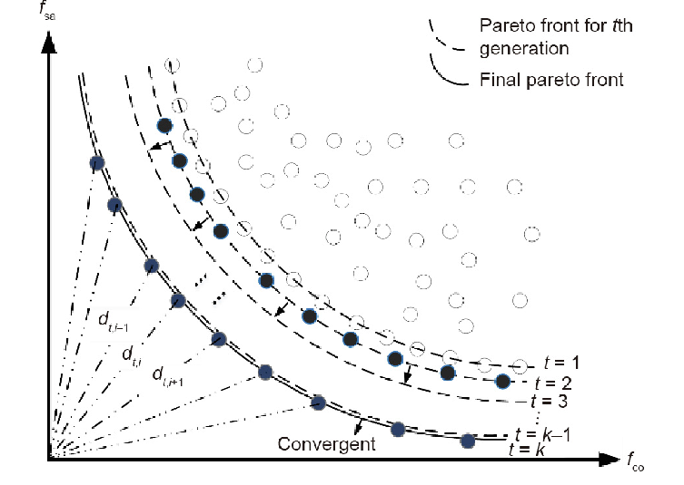

<a name=top> 
  
&nbsp;<a href="/README.md#top">home</a> ::
  <a href="/docs/syllabus.md#top">syllabus</a> ::
  <a href="https://docs.google.com/spreadsheets/d/16yxmklx4zvmfAHE7QocOQZZ4v4UxD5ktJHWMJEjBcMI/edit#gid=0">groups</a> ::
  <a href="/LICENSE.md#top">&copy;&nbsp;2024</a>, <a href="http:/timm.fyi">Tim Menzies</a> 
  

# Landscape Analysis and Recursive Random Projections

The motto on SMO might be, learn a little, find regions of doubt, try there.

The motto of RRP is "look before your leap".

RRP is a landscape analysis technique:
- for _y=f(x)_ ,
  - if_x_ is cheap to explore but _y_ is expensive
  - look for patters in the independent_X_ variables
    - before exploring the _Y_ s
  - e.g in the following picture, if _y_ is some vertical goal function, then the other
    two dimensions are the _x_ choices

For multi-goal-reasoning, it is useful to consider things as two spaces, the _X_s and the _Y_s
(so _f_ is the magic that bridges _X_ s to  _Y_ s)

In _Y_ space, many algorithms work in _generations_, find the best fo far (pruning the rest) then designing the next generation solution from the Pareto frontier seen so far,
- **Definition:** The Pareto frontier is a set of solutions that represents the best trade-off   between all  the      objective functions

To know the landscape is to know how to optimize, how to avoid getting stuck on being over-adapted (hence overspecialized) on some local peak, when as Stewart Brand so aptly puts it...

- "Whole mountain ranges of opportunity could be glimpsed in the distance, but getting to them involved venturing 'downhill' into regions of lower fitness".

Studying such landscapes made Brand distrust claims for "optimality" since what you call "optimum" may actually be just a stepping zone to a better place.

Brand's favorite landscape comes from a 1932 genetics paper[^wright] that discusses how different breeding strategies respond well (or badly) to environmental pressures. In the following, the horizontal and vertical axis represent combinations of genetic choices
(e.g.   "length of hair"   "body weight", "how fast can u run?") and the contours  might "probability of winning a fight". 
- Each frame represents different evolutionary scenarios and their impact on the population in question.
- Frame C differs from the other five frames in that it represented a changing environment, which would create a dynamic landscape, so the population is shown tracking a moving landscape by the arrow.

[^wright]:  The Roles of Mutation, Inbreeding, crossbreeding and Selection in Evolution. Wright, S. Proceedings of the XI International Congress of Genetics, 8:209-222, 1932.

Once you get this diagram, you'll never un-see it. 

- The world as you know it, will no longer be merely three-dimensional. 
- Instead as you walk down the street, you
will realize you are walking a landscape to maximize shade, minimize travel time, minimize distance
to coffee shop and dry-cleaners, etc. etc, etc.

FYI, while it is not commonly stated, in my view, 
Landscape analytics generalizes a range of
algorithms from different fields:
- When used on the _𝑋_ shape, landscape analytics might be called “clustering”.

- And once we find what parts of _X_ parts to what parts of _Y_ then we can do prediction
  (regression and classification to predict numbers and symbols)
- And the delta between different parts of the landscape (with dufferent _Y_ scores)
  might be called "planning" or "optimizaton"
- When used on the _𝑋, 𝑌_ shape, if we only sample a few times at each part of
  the landscape, then limited sampling might be called “semi-supervised learning”;
- Similarly, in a joint analysis of the _𝑋, 𝑌_ shape, if we bias our “leaps” towards regions that (in
the past) had good _𝑌_ scores, 
  - landscape analytics might be called “reinforcement learning”.
- And if we use landscape analytics to jointly explore the _Y_ goals such as performance
   shapes, then this could be called
   “hyperparameter optimization”

In a recent survey of landscape analytics methods, Malan [36] notes that the term “landscape” is
a generalization of Sewell’s 1932 concept of “fitness landscape” [65] which was first defined for
evolutionary biology. Malan reports no less than 33 “families” of landscape analytics methods. Most
of these methods tend to enumerate the whole landscape, before exploring it. This approach is seen
in many parts of the Table 3 summary of the Malan survey; e.g.:
(1) Methods that assume that evaluation is fast or cheap usually exploit that property to make
many samples across the landscape.
(2) Methods that assume knowledge of optima also assume that the search space has been
pre-explored (to find that best point).

Landscap analysis:
-  data mining/ optimization =  as a search across landscapes. 
-  Given many examples of_(𝑋1, 𝑌1), (𝑋2, 𝑌2), .._ etc then a learner_𝐿_ seeks some model_f_ that knows where parts
of the_𝑋_ landscape connect to particular parts of the 𝑌 landscape.
