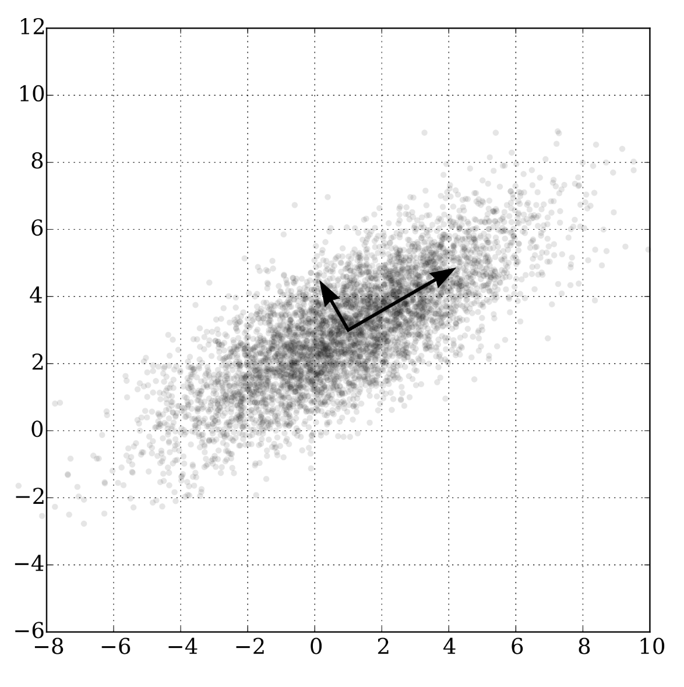

<a name=top><br>
  <p align=center>&nbsp;<a href="/README.md#top">home</a> ::
  <a href="/docs/syllabus.md#top">syllabus</a> ::
  <a href="https://docs.google.com/spreadsheets/d/16yxmklx4zvmfAHE7QocOQZZ4v4UxD5ktJHWMJEjBcMI/edit#gid=0">groups</a> ::
  <a href="/LICENSE.md#top">&copy;&nbsp;2024</a>, <a href="http:/timm.fyi">Tim Menzies</a><br>
  <a href="/README.md#top"></a></p>


# Theory of Landscape Analysis and Recursive Random Projections


## Relevance to SE


Applications:
- as a runtime checker (cluster the data, then report any new inputs that fall outside the range of the clusters of the test data used to test the system)[^liu]
- as an optimization tool (don't explore the whole space; instead cluster and run your analysis on many small clusters)[^maj18][^riot]
- as an optimizer in its own right (see below)[^chen]
- as a test generation tool (to partition the input space, then run just a few tests per partition) [^stall]
- as a verification tool to visualize the output space of a system[^davies] 
- as a requirements engineering tool (to encourage a fast discussion across the whole space)[^leit]
  - In the summer of 2011 and 2012,  I spent two months working on-site at Microsoft Redmond, observing data mining analysts.
    - I observed numerous meetings where Microsoft’s data scientists and business users discussed logs of defect data. 
    - There was a surprising little inspection of the output of data miners as compared to another process, 
        which we might call _fishing_. 
    - In fishing, analysts and users spend much time inspecting and discussing small samples of either raw or exemplary or synthesized project data. 
    - For example, in _data engagement meetings_, users debated the implications of data displayed on a screen. 
    -  In this way, users engaged with the data and with each other by monitoring each other’s queries and checking each other’s conclusions.
- As a privacy tool (why share all the data? why not just cluster and just a few cluster centroids?)[^peters]
  - [Fayola Peters](https://www.ezzoterik.com/papers/15lace2.pdf) used cluster + contrast to prune, as she passed data around a community. 
   - For example, in the following, green rows are those nearest the cluster centroids and blue rows are the ones most associated with the last column
       (bugs/10Kloc).
   - Discard things are aren't blue of green. 
   - She ended up sharing 20% of the rows and around a third of the columns. 1 - 1/5\*1/3 thus offered 93%   privacy
   - As for the remaining 7% of the data, we ran a mutator that pushed up items up the boundary point between classes (and no further). Bu certain common measures of privacy, that made the 7% space 80% private. 
   - Net effect 93% + .8*7 = 98.4% private,
   - And, FYI, inference on the tiny green+blue region was as effective as inference over all


[^peters]: Peters, Fayola, Tim Menzies, and Lucas Layman.](https://www.ezzoterik.com/papers/15lace2.pdf)
    2015 IEEE/ACM 37th IEEE International Conference on Software Engineering. Vol. 1. IEEE, 2015.


[^davies]: Davies, Misty, and Karen Gundy-Burlet. 
  ["Visualization of Global Sensitivity Analysis Results Based on a Combination of Linearly Dependent and Independent Directions."](https://ntrs.nasa.gov/api/citations/20110010856/downloads/20110010856.pdf)
  AIAA Infotech@ Aerospace 2010. 2010. 3387.


[^stall]: Dimitri Stallenberg, Mitchell Olsthoorn, and Annibale Panichella. 2022. 
 [Improving test case generation for REST APIs through hierarchical clustering] https://chinagator.github.io/papers/J5.pdf)
 In Proceedings of the 36th IEEE/ACM International Conference on Automated Software Engineering (ASE '21). IEEE Press, 117–128. https://doi.org/10.1109/ASE51524.2021.9678586


[^maj18]: Suvodeep Majumder, Nikhila Balaji, Katie Brey, Wei Fu, and Tim Menzies. 2018. 
[500+ times faster than deep learning: a case study exploring faster methods for text mining stackoverflow](https://arxiv.org/pdf/1802.05319.pdf). 
In Proceedings of the 15th International Conference on Mining Software Repositories (MSR '18). Association for Computing Machinery, New York, NY, USA, 554–563. https://doi.org/10.1145/3196398.3196424


[^leit]: Veerappa, Varsha, and Emmanuel Letier. 
  ["Understanding clusters of optimal solutions in multi-objective decision problems."](http://www0.cs.ucl.ac.uk/staff/e.letier/publications/2011-clusteringSolutions.pdf)
  2011 IEEE 19Th international requirements engineering conference. IEEE, 2011.


[^liu]: Liu, Z., Qin, T., Guan, X., Jiang, H., & Wang, C. (2018). 
  [An integrated method for anomaly detection from massive system logs](https://ieeexplore.ieee.org/stamp/stamp.jsp?arnumber=8371223)
  IEEE Access, 6, 30602-30611.


[^riot]:  Jianfeng Chen, Tim Menzies:
  [RIOT: A Stochastic-Based Method for Workflow Scheduling in the Cloud](https://arxiv.org/pdf/1708.08127.pdf)
  IEEE CLOUD 2018: 318-325


[^chen]: J. Chen, V. Nair, R. Krishna and T. Menzies, 
 ["Sampling” as a Baseline Optimizer for Search-Based Software Engineering,"](https://arxiv.org/pdf/1608.07617.pdf)
 in IEEE Transactions on Software Engineering, vol. 45, no. 6, pp. 597-614, 1 June 2019, doi: 10.1109/TSE.2018.2790925.


## Notes on Distance

### Families of Distance Functions

- Taxicab distance (L1 distance), also called Manhattan distance, which measures distance as the sum of the distances in each coordinate.
- Eucldean distance (L2 distance)
- Minkowski distance (Lp distance), a generalization that unifies Euclidean distance, taxicab distance, and Chebyshev distance.

$$ D\left(X,Y\right) = \biggl(\sum_{i=1}^n |x_i-y_i|^p\biggr)^{\frac{1}{p}} $$$


### Btw, Traditional Random Projections

- Take dataset K, of the dimension M x N
  - M=samples (rows)
  - N=original dimension/features) (columns)
- Initialize a random 2d matrix R of size N x D where D= new reduced dimension
  - just throw down some random numbers
- Normalize the columns of R making them unit-length vectors.
- Matrix multiplication:
  - J=K * R. 
  - J is the final output with dimension M x D.

### Distance Calcs are often the Slowest Thing

Btw, distance calculations are really slow

- heuristic for faster distance: divide up the space into small pieces (e.g. &sqrt;(N)
- Space between pieces = &infty;
- Space inside pieces: L2

Incremetal tactic one:

- Read $N$ instances, generate $C$ clusters in a tree
- Read next $N$ instances, find their nearest clusters
  - keep the anomalies in those near clusters (things not close to known clusters)
  - when anomalizes grow to (say), more than 10%, rejig just that sub-tree
  - incrementally updating subtrees with anomalies can be 10,000 times faster than
    globally re-organizing all clusters [^kirk].

[^kirk]:Kiriakidis, K., Gordon-Spears, D.F. (2003). Formal Modeling and Supervisory Control of Reconfigurable Robot Teams. In: Hinchey, M.G., Rash, J.L., Truszkowski, W.F., Rouff, C., Gordon-Spears, D. (eds) Formal Approaches to Agent-Based Systems. FAABS 2002. Lecture Notes in Computer Science(), vol 2699. Springer, Berlin, Heidelberg. https://doi.org/10.1007/978-3-540-45133-4_8


Incremetal tactic two:

- Mini-batch k-emans [^sculley].

```
1: Given: k, mini-batch size b, iterations t, data set X
2: Initialize each c ∈ C with an x picked randomly from X
3: v ← 0
4: for i = 1 to t do
5:      M ← b examples picked randomly from X
6:      for x ∈ M do
7:          d[x] ← f(C, x) // Cache the center nearest to x
8:      end for
9:      for x ∈ M do
10:         c ← d[x]        // Get cached center for this x
11:         v[c] ← v[c] + 1 // Update per-center counts
12:         η ← 1/v[c]      // Get per-center learning rate
13:         c ← (1 − η)c + ηx // Take gradient step
14:     end for
15: end for
```

[^sculley]: Web-scale k-means clustering, D Sculley, Proceedings of the 19th international conference on World wide web, 1177-1178. https://citeseerx.ist.psu.edu/document?repid=rep1&type=pdf&doi=b452a856a3e3d4d37b1de837996aa6813bedfdcf


## Some Distances don't matter (so much)

The data is linearly transformed onto a new coordinate system such that the directions (principal components) capturing the largest variation in the data can be easily identified.

- The first principal component is the  direction that maximizes the variance of the projected data. 
- The $N+1$ -th  component  isa direction orthogonal to the first 
 $N$ -th  principal components that maximizes the variance of the projected data.




BTW, the recursive Fastmap algorithm described last week is actually a   Nystrom algorithm (an approximation
to PCA).

Common visualization technique: draw N dimensions as 2 on a flat piece of paper, using the first two compoenets

[^platt]: John Platt FastMap, MetricMap, and Landmark MDS are all Nystrom Algorithms, MSR-TR-2004-26, January 2005  https://proceedings.mlr.press/r5/platt05a/platt05a.pdf

### Distance gets weird 


[Distance is wierd](https://haralick.org/ML/useful_things_about_machine_learning.pdf):

- for an large dimensional orange, most of the mass is in the skin
- volume of the space increases so fast that the available data become sparse.
- amount of data needed to support the result grows exponentially with dimensions
 

High-dimensional data can be approximated in lower dimension
- **Continuity Assumption:**  Points which are closer to each other are more likely to have the same output label.
- **Cluster Assumption:**  Data can be divided into discrete clusters and points in the same cluster are more likely to share an output label.
- **Manifold Assumption:**   high dimensional data can be randomly projected into a lower dimensional  space while controlling the distortion in the pairwise distances. 
  - <a href="https://scikit-learn.org/stable/auto_examples/miscellaneous/plot_johnson_lindenstrauss_bound.html">Examples</a>.
- So we only have to   fit relatively simple, low-dimensional, highly structured subspaces.
- Within a manifolds,  we can  interpolate between two inputs, that is to say, morph one into another via a continuous path along which all points fall on the manifold. 

Why reduce dimensions?

- lower dimensions = less search = easier explanation
- higher dimensionality = more complexity = harder to find releveant examples = less reproduability = less validation = less trust
-  To see this, consider the volume of an $n$-dimensional sphere. 
   -  $V_2( r )={\pi}r^2$ 
   -  $V_3( r )=\frac{4}{3}{\pi}r^3$ 
   - $V_{n>3}( r )= \frac{{2\pi}r^2}{n} V_{n-2}( r )$. 
   -  Now consider the unit sphere i.e. $r=1$   for $n>2\pi$. 
       - Observe how after $n=6$, the volume starts shrinking and hits zero at $n=20$
- So hard to find nearby (relevant) examples
  - Trick: find a transform to map higher to lower.


