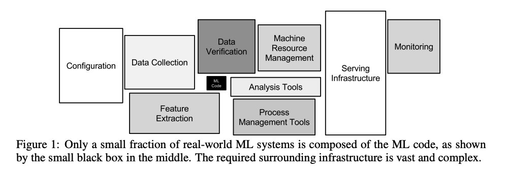
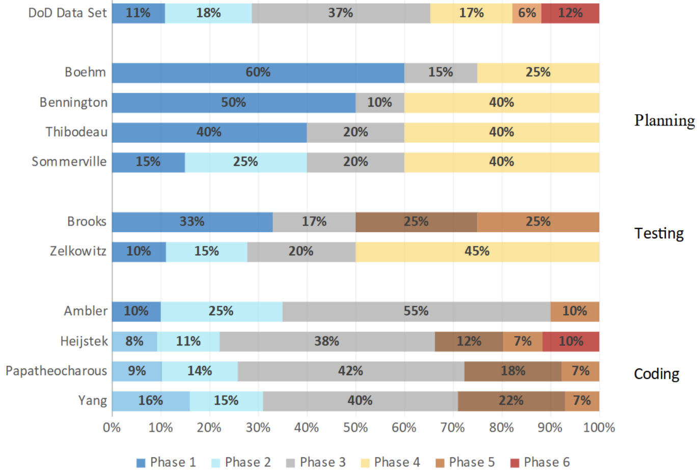
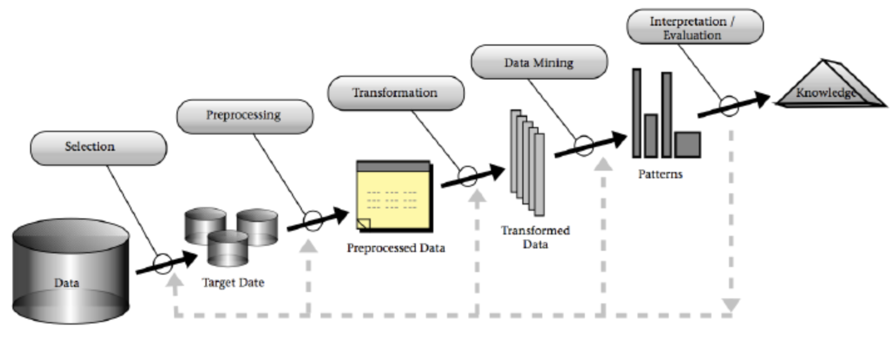
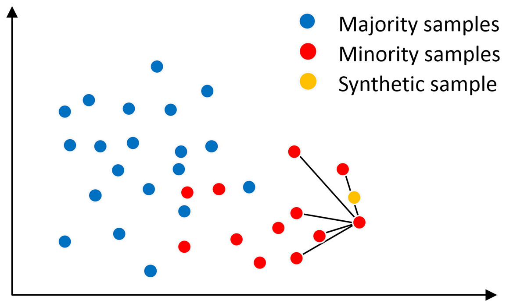

<a name=top> 
  
&nbsp;<a href="/README.md#top">home</a> ::
  <a href="/docs/syllabus.md#top">syllabus</a> ::
  <a href="https://docs.google.com/spreadsheets/d/16yxmklx4zvmfAHE7QocOQZZ4v4UxD5ktJHWMJEjBcMI/edit#gid=0">groups</a> ::
  <a href="/LICENSE.md#top">&copy;&nbsp;2024</a>, <a href="http:/timm.fyi">Tim Menzies</a> 
  

# Management AI projects

"Bus drivers need a bus"
- bus drivers can't do their job without a bus, roads, petrol stations, mechanics, etc etc
- i.e. intelligence needs infrastructure [^sculley].
- AI software is still software, needs software engineerings

[^sculley]: D. Sculley, Gary Holt, Daniel Golovin, Eugene Davydov, Todd Phillips,
Dietmar Ebner, Vinay Chaudhary, Michael Young, Jean-Franc¸ois Crespo, Dan Dennison,
"Hidden Technical Debt in Machine Learning Systems",  Advances in Neural Information Processing Systems 28 (NIPS 2015) https://papers.nips.cc/paper_files/paper/2015/file/86df7dcfd896fcaf2674f757a2463eba-Paper.pdf

## Case Study

LexisNexis asked us to use AI to help manage their cloud services [^chen]:

- Mis-managed cloud services results in server downtime and an associated loss of revenue, 
  - particularly for organizations with penalty clauses in their service contracts. 
  - Even down times of just a few hours is detrimental to the professional reputation of an cloud-service provider. 
  - Poor reputation for reliability =  harder time attracting and retaining clients.
  - Service spikes can freeze up a cloud server. 
- Spikes like those shown below can lead to frustratingly slow systems performance (e.g. very slow displays of new web pages). 
  - Predicting service spikes is hard since they can occur rarely and may occur as sudden extreme outliers. 
  - Spike prediction is cmplicatied by rapidly changing nature of cloud environments. For example, 
  - In the year or two, LexisNexis has retired its locally managed CPU farms in favor of CPU farms managed by multiple major cloud vendors. 
  - Given the rapid pace of change in this area, more changes are expected soon.

[^chen]: Jianfeng Chen, Joymallya Chakraborty, Philip Clark, Kevin Haverlock, Snehit Cherian, and Tim Menzies. 2019. Predicting Breakdowns in Cloud Services (with SPIKE). 
FS'19 (industrial track).  August 26–30, 2019, Tallinn, Estonia. ACM, New York, NY, USA, 9 pages. https://doi.org/10.1145/3338906.3340450

Initially, we imagined that we would be building a recommender system that would

- suggest the number and type of cloud server instances that should be added or deleted
- in order to maintain service availability (at minimum cost). 
- In theory, such a recommender system could be learned from the historical logs of prior nominal and off-nominal behavior.
- But, once we realized how fast the cloud services were changing, i
  - we also realized that much of the historical log was no longer relevant to current practice. 

So we changed track and asked
“what are the major pain points of running the LexisNexis cloud
service?”. 
- This new question prompted our subject matter experts to
recounted various war stories about what happens when a service
spike occurs. 
- “It can take five to ten minutes to realize we have a
problem”, we were told, “after which it can take another few minutes
of calling/texting to get everyone we need into a conference call”.
- New goals:
  - Build comprehensible and effective predictors for service spikes, 30 minutes into the future

So welcome to the management of AI-releated projects
- Initial plans... change
- So how do we manage this project exploring for good ways to use AI to tame cloud computing?

## The SE View

- Long et al. [^long23] ask the question "how much of SE is coding and how much is something else?".
- To answer that question, they look at 20 years of their own
empirical data and 50 years of the SE literature.
- They break up SE development
into six phases (listed below)  and ask, in each, do software engineers (a) plan what to do; (b) do some coding; or (c) check what you got.
  1. Requirements Analysis
  2. Architecture & Design
  3. Coding
  4. System Integration
  5. Qualification Testing
  6. Development Test & Evaluation
  
 Long et al. argue that, on balance, engineers spend a third of the time
in planning, coding, and testing. And here are their numbers:

{ width=500px }

[^long23]: D. Long, S. Drylie, J. Ritschel and C. Koschnick, 2023,
"An Assessment of Rules of Thumb for Software Phase Management, 
and the Relationship between Phase Effort and Schedule Success," 
in IEEE Transactions on Software Engineering, doi: 10.1109/TSE.2023.3339383.

## The Classic View

"Most of data _mining_ is really data _pre-processing_."

From [^fayyad96].

[^fayyad96]: Fayyad, U., Piatetsky-shapiro, G., Smyth, P.: From Data Mining to Knowledge Discovery inDatabases. AI Magazine pp. 37–54 (1996)

1. Data Cleaning:
    - Real-world data is messy. This step involves removing any inconsistencies, errors, or outliers that might skew the results.
    - BTW, another view on outliers... they are a speciality group you need to explore
      - So why not keep the outliers? Cluster the data into many groups, and build different models
        for each group. 
2. Data Integration:
   - Data often comes from many sources, each with its own format and structure. 
   - Must be mergeds this data into a unified set, ensuring consistency and reducing redundancy.
   - Quandry: here you make decisions about what data to exclude... without knowledge of 
     what is going on in the data.
3. Data Selection: 
   - Not all data is relevant for every analysis. 
   - Here, you’ll select the subset of data that pertains to your specific objective.
   - Data selection can be very powerful 
     - The early bird effect [^shrik23]
     - Data collected from the first 3 months of a project does as good as anything else?
       - Why?
       - Most mistakes are make early in the life cycle
       - Early data most informative on what can go wrong.
4. Data Transformation:
   - Data might need to be summarized, aggregated, or otherwise transformed to make it suitable for mining.
   - Discetization: condense signals spread plus to minus infinity into a small number of bins (e.g. low, medium, high)
   - Feature selection: some columns matter more than others. Delete noisy ones? Surprisingly 
     effective (see [Fig2,3](fss.pdf) from [^chen05]).
     - Freaky idea: best thing to do with most data is throw it away
   - Instance selection: if there are repeated signals in the data, why deal with all examples?
     Why not (e.g.) just reason about one example per cluster? [^alvarez]
   - Labelling (adding "y" values to each example; e.g. car=good, food=tasty, code=buggy)
     - Generating adequate labeled training data can be very expensive via human labor.
     - For example:
       - Two years, four people (part time) to collect and validate
         [ 93 rows times 29 columns](https://gist.githubusercontent.com/timm/d47b8699d9953eef14d516d6e54e742e/raw/ee8ba8992d7fa6c15a74d627d149a93b8eca44be/nasa93dem.csv)
     - For example, 
       - Tu et al. [^tu20] has studied approximately 714 software projects, including 476,000 commit files. 
       - After an extensive analysis, they proposed a cost model for labeling that data. 
       - Assuming two people checking per commit, that data would need three years of effort to label the data.
   - Imbalanced data: when the target class is rare, hard for the learner to find it.
     - Many solutions; e.g. discard random majority samples, make more minority samples 
       via SMOTE: 
       - find k nearest neighbors of same klass
       - interpolate a new example at a random distance between you and one of those k
       - SMOTE has some magic control parameters, which should be tuned [^agrawal18]
     - For a study of numerous other methods, see [^ling25].  
5. Data Mining:
   - Using various algorithms and techniques, patterns, trends, and relationships are extracted from the data.
   - Tuning of control parameters
6. Pattern Evaluation:
   - Not all patterns are useful or interesting. This step helps filter out the noise, ensuring only valuable insights are considered.
   - Feedback from business users (often means going back and doing it all again)
7. Knowledge Presentation:
   - The black art of presenting complex things in a simple matter
   - Very audience specific
    - e.g. At NASA, talking to maanagers who do 10 times 30 minute meetings per day,
      I always worked on the "one slide" rule (they could only "swap" in one slide of info).

[^shrik23]: Shrikanth N. C. and Tim Menzies. 2023. Assessing the Early Bird Heuristic (for Predicting Project Quality). ACM Trans. Softw. Eng. Methodol. 32, 5, Article 116 (September 2023), 39 pages. https://doi.org/10.1145/3583565 https://arxiv.org/pdf/2105.11082.pdf
[^agrawal18]: Amritanshu Agrawal and Tim Menzies. 2018. Is "better data" better than "better data miners"? on the benefits of tuning SMOTE for defect prediction. In Proceedings of the 40th International Conference on Software Engineering (ICSE '18). Association for Computing Machinery, New York, NY, USA, 1050–1061. https://doi.org/10.1145/3180155.3180197 https://arxiv.org/pdf/1705.03697.pdf
[^ling25]: Ling, Xiao, Tim Menzies, Christopher Hazard, Jack Shu, and Jacob Beel. "Trading Off Scalability, Privacy, and Performance in Data Synthesis." arXiv preprint arXiv:2312.05436 (2023). https://arxiv.org/pdf/2312.05436.pdf
[^chen05]: Zhihao Chen, Barry Boehm, Tim Menzies, and Daniel Port. 2005. Finding the Right Data for Software Cost Modeling. IEEE Softw. 22, 6 (November 2005), 38–46. https://doi.org/10.1109/MS.2005.151
[^alvarez]: L. Alvarez and T. Menzies, "Don’t Lie to Me: Avoiding Malicious Explanations With STEALTH," in IEEE Software, vol. 40, no. 3, pp. 43-53, May-June 2023, doi: 10.1109/MS.2023.3244713. https://arxiv.org/pdf/2301.10407.pdf
[^tu20]: Huy Tu, Zhe Yu, and Tim Menzies. Better data labelling with EMBLEM (and how that impacts defect prediction). IEEE Transactions on Software Engineering, 2020. https://arxiv.org/pdf/1905.01719.pdf

## How to Manage Projects When the Requirements Keep Changing?

-  waterfall: plan-based [^Royce70]
  - a linear walk through analysis, design, code, test with 
    feedback from `step[i]` updating `step[i+1]`.   

- spiral model: slowly, iterate to explore and (hopefully) retire risk, before committing to a fixed plan [^Boehm88].

 

- agile: maintain a backlog of stuff not yet done [^agile] [^hoda]
  - loop
    - sort backlog by value/time
    - sprint to finish the top N items
    - repeat  
  - can't always do agile
    - co-ordinating   betwwen large teams means setting expectations for when team1 will get material from team2
    - for very large projects (government, DoD), funds have to be negoatiated and pre-allocated (hardly condusive to agile mid-course replanning)
    - for hardware/software co-design
      - hardware is harder and slower to build and change. 
        - so software projects have to be designed to deliver the software, when the hardware needs it 
- agilefall : working at a continuum between plan-driven (a.k.a. waterfall) 
  project management and agile project management
  - usually a pejorative term.
    - we pretend to be agile but actually, we never adapt to change.
  - taken seriously by some [^Bakg]

[^hoda]: Hoda, Rashina, Norsaremah Salleh, and John Grundy. "The rise and evolution of agile software development." IEEE software 35.5 (2018): 58-63.
[^agile]: Beck, K., Beedle, M., Van Bennekum, A., Cockburn, A., Cunningham, W., Fowler, M., Grenning, J., Highsmith, J., Hunt, A., Jeffries, R. and Kern, J., 2001. Manifesto for agile software development. https://agilemanifesto.org/
[^Royce70]: Winston W. Royce (1970). "Managing the Development of Large Software Systems" in: Technical Papers of Western Electronic Show and Convention (WesCon) August 25–28, 1970, Los Angeles, USA.
[^Bakg]: Bakhirkin, M.V., Lukin, V.N. (2022). Agilefall—Modern Realities of IT Project Management. In: Favorskaya, M.N., Nikitin, I.S., Severina, N.S. (eds) Advances in Theory and Practice of Computational Mechanics. Smart Innovation, Systems and Technologies, vol 274. Springer, Singapore. https://doi.org/10.1007/978-981-16-8926-0_26
[^Boehm88]: Boehm, B (August 1986). "A Spiral Model of Software Development and Enhancement". ACM SIGSOFT Software Engineering Notes. 11 (4): 14–24. doi:10.1145/12944.12948. S2CID 207165409.  https://www.cse.msu.edu/~cse435/Homework/HW3/boehm.pdf

## Variants (take with  a grain of salf):

I've often had to offer project plans to companies that like fixed price structures. So I offer them the following:

- Timm1: hop, skip, jmup
  - hop : fixed time (e.g. three months), no fixed deliverables (just a progress report), a few people
    - a.k.a. requirements develioment phase
  - skip:  longer fixed times (e.g. six months), some defined deliverables, more people
    - a.k.a. analysis phase
  - jump:  much more fixed time (e.g. twelve months),  well-defined deliverables, yet more people, all fixed deliverables

- Timm2: the four month rule
  - weekly meetings, subject matter experts and AI team
  - month1:  I don't understand the problem but lets keep talking
  - month2:  I'm beginning to see what is going on, code up analysis tools
  - month3:  I know what I'm doing, I'm trying different things
  - month4:  Finally, we can say useful things to the local experts and they can  undersand what I am doing. Much interaction and interpreation of results.  Report writing.

- Timm3: the elbow test
  - Before we had good data miners, we sough to explore and operationalize human knowledge
  - My and my Prolog interpreter would go interview experts, recording everything they said
  - We'd build a specification language that mimiced their expert prouncements, and an interpretar to make these sentences execute.
  - We'd have the right language when the experts would elbow us out of the way, in their haste to get to the screen and change
    what they thought was wrong.
  - Initially, we'd write the speciication interpreter and sample sentences in that langauge
    - Goals was to train the local domain experts to write (and maintain) their own rules.
  - Project manager heuristics:
    - The "five rules per day" rule
    - The "competancy after 100 rules" rule
  - e.g. Pige. 480 rules for management of piggeries [^pige].

[^pig]: Menzies, T., Black, J., Fleming, J., & Dean, M. (1992, April). An expert system for raising pigs. In The first Conference on Practical Applications of Prolog’. Available from http://aturing.umcs.maine.edu/~meadow/courses/cos301/raising-pigs.pdf

- Don't test
  - Create a lab of 100 teams
  - Each use (say) LLMs to build some widget
  - Race the widgets into the marketplace 
  - Most will die but a tiny fraction will blossom and deliver you an income stream
  - No needs to waste time talking to users, or fussy with specifications,  or testing 
  - Kist throw it over the wall and see what sticks.

- Software 2.0
  - 2017: Karpathy: Software 2.0 [^kel]
  - One perpetually prototyping team supporting another standard SE team
  - Team1: standard se. development. GUIs. Database optimization. etc etc etc 
  - Team2: define choice space for Team1. Explore choices with an optimizer
    - "Gradient descent can write better code than you. I'm sorry".
    - often described within a neural context
    - but as we know, there are more options.
  - "To make the analogy explicit, 
    - in Software 1.0, human-engineered source code (e.g. some .cpp files) is compiled into a binary that does useful work. 
    - In Software 2.0 most often the source code comprises
       - the dataset that defines the desirable behavior 
       - rhe process of training learner compiles the dataset into a model, from which we can set the options.  
    - SE moves from a coding process to a decision process:

[^kel]: Andrej Karpathy, Software 2.0, https://karpathy.medium.com/software-2-0-a64152b37c35, [pdf](soft2.pdf), Nov 11, 2017

### Process Data from Microsoft

- 2017, time spent on variaous tasks in a data science team [^kim17]

  

  

[^kim17]: Kim, M., Zimmermann, T., DeLine, R., & Begel, A. (2017). Data scientists in software teams: State of the art and challenges. IEEE Transactions on Software Engineering, 44(11), 1024-1038.

- 2019: Microsoft's analytics team [^Amershi19]:

[^Amershi19]: S. Amershi et al., "Software Engineering for Machine Learning: A Case Study," 2019 IEEE/ACM 41st International Conference on Software Engineering: Software Engineering in Practice (ICSE-SEIP), Montreal, QC, Canada, 2019, pp. 291-300, doi: 10.1109/ICSE-SEIP.2019.00042.

  

## Anyway, Back to LexisNexis

(Cloud computing, predicting for spikes.

In the end, we optimized for   comprehensibility rather than just predictive performance. 

- Our experts required some report of the lessons learners that they can read, understand and audit.
- Hence, we used data mining methods that produce human readable models (e.g. not Naive Bayes classifiers, not neural networks, not instance-based learners, not random forests).

In all, these results  took three
months to generate:

- 1 month of a LexisNexis data engineer generating our training
data by writing complex joins across large datasets.
- 1 month of inductive engineering, applying different data
mining methods to the data. As mentioned above, this proved
to be a tedious task that required developed and discarding a
dozen very bad predictors before finding one that achieved
useful results
- 1 month of a senior LexisNexis engineer serving as a liaison
between our team and the rest of LexisNexis. The importance
of the liaison cannot be overstated. That person (a) maintained senior management’s awareness and enthusiasm for
this project; (b) organized access to numerous subject matter
experts.

When staffing similar efforts in the future, I'd  recommend a similar
“three-sided” team comprising inductive engineers, data engineers,
and business knowledge experts.

