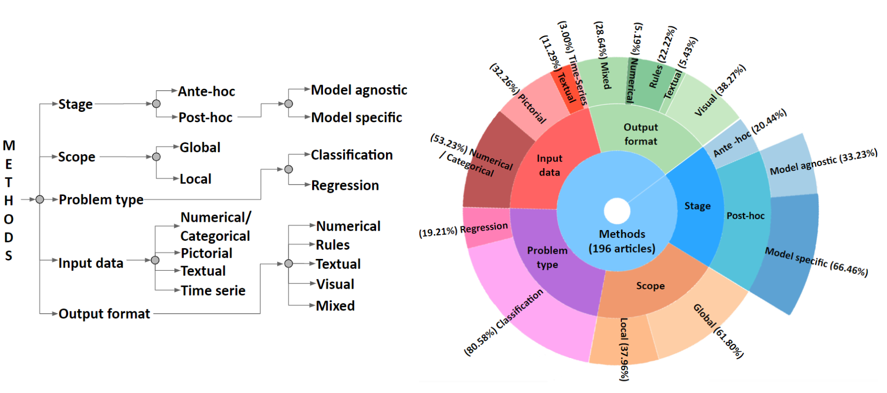
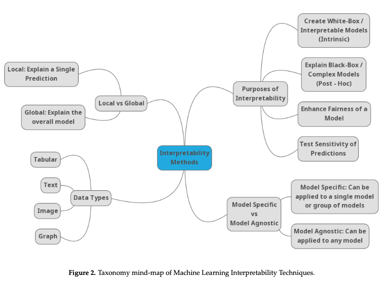
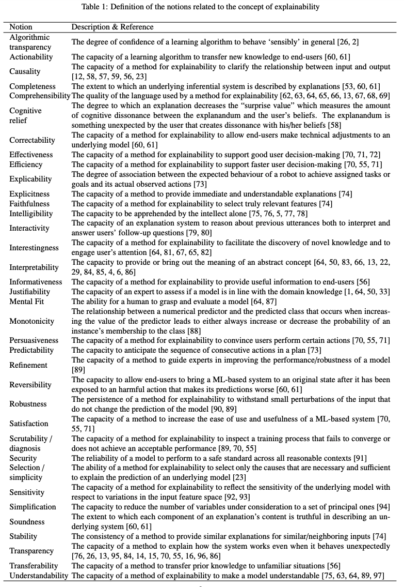

<a name=top><br>
  <p align=center>&nbsp;<a href="/README.md#top">home</a> ::
  <a href="/docs/syllabus.md#top">syllabus</a> ::
  <a href="https://docs.google.com/spreadsheets/d/16yxmklx4zvmfAHE7QocOQZZ4v4UxD5ktJHWMJEjBcMI/edit#gid=0">groups</a> ::
  <a href="/LICENSE.md#top">&copy;&nbsp;2024</a>, <a href="http:/timm.fyi">Tim Menzies</a><br>
  <a href="/README.md#top"></a></p>


 
# Explanation
 
## Instances (points) vs Models (volumes)

Some algorithms are instance-based

- that return a bunch of points
- with no generalization beyond those points
- e.g. a nearest neighbor classifier will give you a prediction
  - but no summary of  the data
  - no sense of "why" that conclusion was made.

Some algorithms are model-based:

- Training data is turned into a model
- Predictions are made from the model
- THis approach returns conclusions _and_ some summary of the data

For example, here is a model called  "fast and frugal tree":

- designed for fast comprehsnabilty
- binary tree, max depth = small (say, 3,4,5)
  - each node is either a decision or a sub-tree.
- [background theory](https://pure.mpg.de/rest/items/item_2100099/component/file_2100098/content)
- [code](https://github.com/ndphillips/FFTrees) in "R"
- the standard example: 


## Theories of Explanation

### Theory1. Explanation = small rules

Larkin et al. [^larkin] characterize human expertise in terms of:

- a  very
small short term memory, or STM (used as a temporary scratch
pad for current observation) 
- and a very large long term memory,
or LTM. 

The LTM holds separate tiny rule fragments that explore
the contents of STM to say “when you see THIS, do THAT”. 
- When
an LTM rule triggers, its consequence can rewrite STM contents
which, in turn, can trigger other rules.

Short term memory is very small, perhaps even as small as four
to seven items [^ma13]

[^larkin]: Jill Larkin, John McDermott, Dorothea P. Simon, and Herbert A. Simon. 1980.
Expert and Novice Performance in Solving Physics Problems. Science 208,
4450 (1980), 1335–1342. DOI:http://dx.doi.org/10.1126/science.208.4450.1335
arXiv:http://science.sciencemag.org/content/208/4450/1335.full.pdf

[^ma13]: Recently, Ma et al. used evidence from neuroscience and functional MRIs to
argue that STM capacity might be better measured using other factors than “number of
items”. But even they conceded that “the concept of a limited (STM) has considerable
explanatory power for behavioral data”. Wei Ji Ma, Masud Husain, and Paul M Bays. 2014. Changing concepts of working
memory. Nature neuroscience 17, 3 (2014), 347–356.

- Experts are experts, says Larkin et al.  
because the patterns in their LTM patterns dictate what to do,
without needing to pause for reflection. 
- Novices perform worse
than experts, says Larkin et al., when they fill up their STM with
too many to-do’s where they plan to pause and reflect on what to
do next.
-  Since, experts post far fewer to-do’s in their STMs, they
complete their tasks faster because (a) they are less encumbered
by excessive reflection and (b) there is more space in their STM
to reason about new information. 

While first proposed in 1981,
this STM/LTM theory still remains relevant [^ma13]. This theory can
be used to explain both expert competency and incompetency in
software engineering tasks such as understanding code [^wieden].

[^wieden]: Susan Wiedenbeck, Vikki Fix, and Jean Scholtz. 1993. Characteristics of the
mental representations of novice and expert programmers: an empirical study.
International Journal of Man-Machine Studies 39, 5 (1993), 793–812.[^]

[^phillips]: Nathaniel D Phillips, Hansjoerg Neth, Jan K Woike, and Wolfgang Gaissmaier. 2017. FFTrees: A toolbox to create, visualize, and evaluate fast-and-frugal decision trees. Judgment and Decision Making 12, 4 (2017), 344–368.

Phillips et al. [^phillips] discuss how models containing tiny rule fragments can be quickly comprehended by doctors in emergency
rooms making rapid decisions; or by soldiers on guard making snap
decisions about whether to fire or not on a potential enemy; or by
stockbrokers making instant decisions about buying or selling stock.

- That is, according to this   theory   humans best understand a model:
  - When they can “fit” it into their LTM; i.e., when that model
comprises many small rule fragments;
  - Further, to have an expert-level comprehension of some domain
meaning having rules that can very quickly lead to decisions,
without clogging up memory.

### Theory2. Explanation =  inference

When we explain something, we do **not** just spit out some trite rule.

- Rather, we reflect over the current context, the goals and background knowledge of the audience
- To generate some artifact that is appropriate in that context for those goals, given that background knowledge.

We partially honor this definition in RRP:

- by building our clusters, 
- then offering a different cluster for the
delta between each pair of clusters

### Theory3,4,5,6,7.... . 

So many other theories of explanation.



 
 
That's one theory of "explanation". There are many more [^vilone] [^linardatos].

[^vilone]: Vilone, G., & Longo, L. (2020). Explainable artificial intelligence: a systematic review. arXiv preprint [arXiv:2006.00093.](https://arxiv.org/pdf/2006.00093.pdf)
[^linardatos]: Linardatos, Pantelis, Vasilis Papastefanopoulos, and Sotiris Kotsiantis. "Explainable ai: A review of machine learning interpretability methods." Entropy 23.1 (2020): 18. https://www.mdpi.com/1099-4300/23/1/18/pdf

<br clear=all>



In fact "explanation" is often cited as core sub-routine in 40+ AI tasks.

- Why?
- Well, to explain "it" means summarization  "it" then somehow exercising that summary
- So you can't explain "it" without doing "it"
- Explanation is... everything?
   - Once you clarify "explanation" in logical terms [^menzies96], that clarification also covers many other tasks
    (validation, prediction, classification,   tutoring, qualitative reasoning, planning, monitoring, set-covering diagnosis, and consistency-based diagnosis).

[^menzies96]: Tim Menzies, [Applications of abduction: knowledge-level modelling](menzies1.pdf), Int. J. Human–Computer Studies (1996) 45, 305–335

## Returning to our Homeworkds

Lets keep it simple and produce rules that describe the delta between two clusters.

### Ranges

Here's a magic trick to make inference simpler, and to generate tiny theories:

- Take some data
- Seperate the data into different groups (clusters)
- Find what values are different in different classes
- Divide numeric ranges to emphasis those differences
  - i.e. ignore the range "(age in 10 to 20)" if its frequency is the _same_ in each group 
  - i.e. focus on that range its frequency is wildly different in each group
- Only reason about the most interesting ranges


This is called  _discretization_: 

> <em> the transformation a set of continuous attributes into discrete ones, by associating categorical values to intervals and thus transforming quantitative data into qualitative data[^garcia].</em>

Note that once you have the above going, the generating rules   is just a matter of iterative    descritization (see next week).

For another example of this, here the magic applied to diabetes data. Note that:
- No useful divisions were found for `pres`,and `skin` (and attributes whose ranges have the same distributions in all classes are boring)
- Most ranges make very little change to the default class distribution shown bottom right (blue:red = `not`:`diabetic` = 5:3).
  - But there are some beauties e,g, 
    - `plas=hi` is strongly associated with  for `diabetic`
    - `mass=lo` or `plas=lo` is strongly associated with `not`


For another example, suppose we can clustered some data:

```
398  {:Acc+ 15.6 :Lbs- 2970.4 :Mpg+ 23.8}
| 199
| | 99
| | | 49
| | | | 24  {:Acc+ 17.3 :Lbs- 2623.5 :Mpg+ 30.4}
| | | | 25  {:Acc+ 16.3 :Lbs- 2693.4 :Mpg+ 29.2}
| | | 50
| | | | 25  {:Acc+ 15.8 :Lbs- 2446.1 :Mpg+ 27.2}
| | | | 25  {:Acc+ 16.7 :Lbs- 2309.2 :Mpg+ 26.0}
| | 100
| | | 50
| | | | 25  {:Acc+ 16.2 :Lbs- 2362.5 :Mpg+ 32.0}
| | | | 25  {:Acc+ 16.4 :Lbs- 2184.1 :Mpg+ 34.8}
| | | 50
| | | | 25  {:Acc+ 16.2 :Lbs- 2185.8 :Mpg+ 29.6} <== best?
| | | | 25  {:Acc+ 16.3 :Lbs- 2179.4 :Mpg+ 26.4}
| 199
| | 99
| | | 49
| | | | 24  {:Acc+ 16.6 :Lbs- 2716.9 :Mpg+ 22.5}
| | | | 25  {:Acc+ 16.1 :Lbs- 3063.5 :Mpg+ 20.4}
| | | 50
| | | | 25  {:Acc+ 17.4 :Lbs- 3104.6 :Mpg+ 21.6}
| | | | 25  {:Acc+ 16.3 :Lbs- 3145.6 :Mpg+ 22.0}
| | 100
| | | 50
| | | | 25  {:Acc+ 12.4 :Lbs- 4320.5 :Mpg+ 12.4}
| | | | 25  {:Acc+ 11.3 :Lbs- 4194.2 :Mpg+ 12.8} <== worst
| | | 50
| | | | 25  {:Acc+ 13.7 :Lbs- 4143.1 :Mpg+ 18.0}
| | | | 25  {:Acc+ 14.4 :Lbs- 3830.2 :Mpg+ 16.4}
```

And then we use the same algorithm to wind our way down to the best leaf cluster:

```
398  {:Acc+ 15.6 :Lbs- 2970.4 :Mpg+ 23.8}
| 199
| | 100
| | | 50
| | | | 25  
| | | |   12 {:Acc+ 17.2 :Lbs- 2001.0 :Mpg+ 33.2}
```

Let _best_ be the 12 examples in best cluster and _rest_ be $|\text{best}|*4$ of
the others, picked at random (aside: why not use them all?)

```lua
-- Minor  change:`sway` now returns the best rows and "the.rest=4" of other
function sway(data,     worker,best,rest)
  function worker(rows,worse,  above)
    if   #rows <= (#data.rows)^the.min 
    then return rows, many(worse, the.rest*#rows)  -- <== note change here
    else local l,r,A,B = half(data, rows, cols, above)
         if better(data,B,A) then l,r,A,B = r,l,B,A end
         map(r, function(row) push(worse,row) end) 
         return worker(l,worse,A) end 
  end ----------------------------------
  best,rest = worker(data.rows,{})
  return DATA.clone(data,best), DATA.clone(data,rest) end 
```

Now we are going to divide all the numeric ranges into 16 buckets, then recursively
merge ranges with the same distribution in _best_ and _rest_. Here's what we get
(and on the RHS, we score how much of each class is selected by that range). Note that
- strongly associated with `best` are `volume=[90..115)` and `Cylinders=3` and `origin=3`  
- most associated with `rest` is `volume >= 115` 


```
all                                       {:best 12 :rest 48}

          [lo<=x< hi)
          ===========
Clndrs    -inf       3        | 0.08     | {:best 1}
Clndrs    3          4        | 0.64     | {:best 11 :rest 19}
Clndrs    4        inf        | 0.0      | {         :rest 29}

Volume    -inf     90         | 0.69     | {:best 9  :rest 3}
Volume    90      115         | 0.17     | {:best 3  :rest 6}
Volume    115     inf         | 0.0      | {         :rest 39}

Model    -inf      77         | 0.0     | {         :rest 30}
Model    77        78         | 0.28    | {:best 4  :rest 3}
Model    78        79         | 0.12    | {:best 2  :rest 3}
Model    79        80         | 0.43    | {:best 6  :rest 4}
Model    80       inf         | 0.0     | {         :rest 8}

origin    1         1         | 0.0     | {         :rest 33}
origin    2         2         | 0.0     | {         :rest 8}
origin    3         3         |0.87     | {:best 12 :rest 7}
```

Note that there are very few most powerful ranges
- This is a common result (i.e. a few things matter and the rest can go to he\*ck).
- Once we know the above, then all subsequent inference is just a search through a couple of ranges. Ezy,pezy.

## How to Discretize

There are so many ways to implement discretization [^garcia][^liu]:

[^garcia]: Salvador Garcia, Julian Luengo, Jose A. Saez, Victoria Lopez, and Francisco Herrera. 2013. 
  [A Survey of Discretization Techniques: Taxonomy and Empirical Analysis in Supervised Learning](/etc/pdf/discretization.pdf). 
  IEEE Trans. on Knowl. and Data Eng. 25, 4 (April 2013), 734–750. https://doi.org/10.1109/TKDE.2012.35


Lets just list some simple ones:

- Unsupervised (make no reference to $y$ attributes):
  - EWD: equal width discretization:  `(max-min)/the.bins`
  - EFD: equal frequency discretization: sort numbers, divide into (say) 10% chunks
- Supervised (divide $x$ by reflecting on $y$)
  - EMD: entropy merge discretization
    - post-processor to unsupervised discretization:
      - divide into (say) 16 bins, then remove uninformative bins
      - recursively combine adjacent bins (if the parts are less informative than the combination)

eg. can `alive` supervise our discretization of `age`?

```
age | alive
----|------
  5 | y
500 | y
 33 | y
100 | n
 60 | y
800 | y
 10 | y
120 | n
 40 | y
200 | n  
 90 | n
700 | y
 99 | y
 50 | y
130 | n
999 | y
```
Step1, sort on `age`:

```
age | alive
----|------
  5 | y
 10 | y
 33 | y
 40 | y
 50 | y
 60 | y
 90 | n
 99 | y
100 | n
120 | n
130 | n
200 | n  
500 | y
700 | y
800 | y
900 | y
```
So we seem to have some long lived  aliens amongst us. 

Now one way to find our bins is to first divide the day into (say) five bins of size two,
then look for adjacent bins that are so similar that we can merge them:

```
age | alive | bins
----|-------|-----
  5 | y     | one
 10 | y     | one
 ------------------
 33 | y     | two
 40 | y     | two
 ------------------
 50 | y     | three
 60 | y     | three
 ------------------
 90 | n     | four
 99 | y     | four
 ------------------
100 | n     | five
120 | n     | five
 ------------------
130 | n     | six
200 | n     | six
 ------------------
500 | y     | seven
700 | y     | seven
 ------------------
800 | y     | eight
900 | y     | eight
```

See note the numbers of "alive=y" and "alive=n" are the same in bins one+two+three and five+six and seven+eight. And a similar pattern happens in the middle (but that 99 messes things up a little).
But accommodating a little bit of noise then we get three bins.

```
age | alive | combined bins
----|-------|-----
  5 | y     | one
 10 | y     | one
 33 | y     | one
 40 | y     | one
 50 | y     | one
 60 | y     | one
 ------------------
 90 | n     | two
 99 | y     | two
100 | n     | two
120 | n     | two
130 | n     | two
200 | n     | two
 ------------------
500 | y     | three
700 | y     | three
800 | y     | three
900 | y     | three
```

OK, lets code that up.

## Preambles 

1. In the above we did EMD as a port-processor to EFD (equal frequency discretization). 
   It turns out that it is much easier to use EWD (equal width discretization)
   instead (see below).
2. In this code base, I tried a technology change that seemed to make things simpler:
   - No objects, all procedural
   - Feel free _not_ to do things this way and stick with your old objects

The switch to procedure changed some details
- e.g.  For polymorphism, I had to add `isSym=true` to all `Sym`s:
  - so `aNum.isSym` return nil
  - and `aSym.isSym` return true

```lua
-- factory for making NUM,SYM
function COL(n,s,    col)
   col = s:find"^[A-Z]" and NUM(n,s) or SYM(n,s) 
   col.isIgnored  = col.txt:find"X$"
   col.isKlass    = col.txt:find"!$"
   col.isGoal     = col.txt:find"[!+-]$"
   return col end

-- Create a `NUM` to summarize a stream of numbers.
function NUM(n,s) 
  return {at= n or 0, txt= s or "", n=0,
          hi= -m.huge, lo= m.huge, 
          ok=true, has={},
          w= (s or ""):find"-$" and -1 or 1} end

-- Create a `SYM` to summarize a stream of symbols.
function SYM(n,s)
  return {at=n or 0, txt=s or "", n=0, 
          mode=nil,  most=0,
          isSym=true, has={}} end
```

Now I write (e.g.) one `add` for both  `NUM`s and `SYM`.
- and this NUM implements _reservoior sampling_
  - if the cache of seen numbers is full, replace anything at random
  - else just add to cache

 ```lua
function add(col,x,  n)
  if x ~= "?" then
    n = n or 1
    col.n = col.n + n
    if   col.isSym -- here's the caseing on type
    then -- handle SYMs
         col.has[x] = n + (col.has[x] or 0) 
         if col.has[x] > col.most then
           col.most, col.mode = col.has[x],x end 
    else -- handle NUMs
         local all,pos
         col.lo, col.hi = m.min(x,col.lo), m.max(x,col.hi) 
         all = #col.has
         pos = (all < the.Max and all+1) or (          -- cache not full, add to end
               rand() < the.Max/col.n and rint(1,all)) -- cache full, replace at random
         if pos then
           col.has[pos] = x
           col.ok = false  -- remember we have to do a resort
end end end end 
```
If anything is added, the cache may no longer be sorted
- so before we return the cache of seen numbers, check if we need to do a resort

```lua
function has(col)
  if not col.isSym and not col.ok then sort(col.has) end 
  col.ok = true      -- the invariant here is that "has" is ready to be shared.
  return col.has end
```

Here's another change (that you can ignore for this week's homework).
A `SYM`'s diversity is worked out as per usual (entropy) but for `NUM` we use the 90-10 trick
(the standard deviation is the (90th-10th) percentile/2.56. (Why?
since the 90th and 10th percentiles are &pm;1.28\*&sigma; of a z-curve,
then (90th-10th)/(2*1.28) is the standard deviation.)

```lua
function div(col,    e)
  if   col.isSym 
  then e=0
       for _,n in pairs(col.has) do e= e-n/col.n*m.log(n/col.n,2) end
       return e
  else return (per(has(col),.9) - per(has(col), .1))/2.56 end end
```

## RANGES

Since we  are doing _supervised_ discretization, when we define a range,
we need to track the `lo` and `hi` of that  range _and_ the class symbols seen in that range.

```lua
function RANGE(at,txt,lo,hi) 
  return {at=at,txt=txt,lo=lo,hi=lo or hi or lo,y=SYM()} end

-- RANGEs can be extended 
function extend(range,n,s)
  range.lo = m.min(n, range.lo)
  range.hi = m.max(n, range.hi)
  add(range.y, s) end
```

Note some hacks in the above (which you might want to change):
- `hi` defaults to to `lo` (which is a nice way to initialize a RANGE when you have only
  seen one value yet)
- LUA's `min` and `max` functions will sort strings as well as numerics so our `extend`
  function does not have to consider them as separate cases
- We never define `a range of numerics` and `a range of symbols` since the following hack
  will do
  - if `lo==hi` then we saying we are looking at a symbolic range.

## Information Content

We need some way to look at adjacent RANGEs  and decide they need to be merged. 
Well, if the merged bins have _less_ information than the parts
then the merge contains fewer classes (i.e. it predicts better for one
class or another).

First things first, what is the primitive for combining the frequency counts
of systems seen in two adjacent RANGEs.
```lua
-- To combine two SYMs, jsut combine the frequency counts in `has`.
-- For NUMs, do nearly the same but also extend the lo..hi range.
function merge(col1,col2,    new)
  new = copy(col1)
  if   col1.isSym 
  then for x,n in pairs(col2.has) do add(new,x,n) end  -- handle SYMs
  else for _,n in pairs(col2.has) do add(new,n)   end  -- handle NUMs
       new.lo = m.min(col1.lo, col2.lo)
       new.hi = m.max(col1.hi, col2.hi) end 
  return new end
```

So now we _can_ merge ranges, but when do we want to? Well, as above,
we prefer the whole if it is simpler than the expected values of the parts:
```lua
function merge2(col1,col2,   new)
  new = merge(col1,col2)
  if div(new) <= (div(col1)*col1.n + div(col2)*col2.n)/new.n then
    return new end end
```

Ok, that is how is we merge two RANGEs. How do we merge many RANGEs?
The following bottom-up clustering routines expects a set of RANGEs sorted on their `lo`
value. If it can find two neighbors that can be merged, it does the merge then jumps
over 2 spaces to look for anything else. If the result is a smaller set of ranges,
then it loops back to look for other merges.

```lua
function mergeAny(ranges0,     noGaps)
  function noGaps(t)
    for j = 2,#t do t[j].lo = t[j-1].hi end
    t[1].lo  = -m.huge
    t[#t].hi =  m.huge
    return t 
  end ------
  local ranges1,j,left,right,y = {},1
  while j <= #ranges0 do
    left, right = ranges0[j], ranges0[j+1]
    if right then
      y = merge2(left.y, right.y)
      if y then
        j = j+1 -- next round, skip over right.
        left.hi, left.y = right.hi, y end end
    push(ranges1,left)
    j = j+1 
  end
  return #ranges0==#ranges1 and noGaps(ranges0) or mergeAny(ranges1) end
```
In the above, the function `noGaps` makes sure the resulting ranges run from minus infinity
to plus infinity with no gaps.

## Initializing the RANGEs

Nearly done. All the above assumes we have the columsn divided into, say `the.bins=16`
RANGEs. To generate them, we use the following code.
Note that this code is called per `col` and `rowss` is a dictionary of rows where the keys
of the dictionary are the class names. So if we have two classes `best` and `rest` containing
12 and 48s then

```
{best={row1,row2...row12}
 rest={otherRow1, otherRow2... otherRow48}
}
```

```lua
function bins(cols,rowss)
  local out = {}
  for _,col in pairs(cols) do
    local ranges = {}
    for y,rows in pairs(rowss) do -- the "rows" in class "y"
      for _,row in pairs(rows) do
        local x,k = row[col.at]   -- find an "x" value
        if x ~= "?" then 
          k = bin(col,x)                                   -- that is not nil
          ranges[k] = ranges[k] or RANGE(col.at,col.txt,x) -- find or make x's RANGE
          extend(ranges[k], x, y)                          -- extend that RANGE with x and y
    end end end         
    ranges = sort(map(ranges,itself),lt"lo") -- Sort the ranges
    out[1+#out] = col.isSym and ranges or mergeAny(ranges) -- In col is a num, use "mergeAny"
  end  
  return out end

-- Map `x` into a small number of bins. `SYM`s just get mapped
-- to themselves but `NUM`s get mapped to one of `the.bins` values.
-- Called by function `bins`.
function bin(col,x,      tmp)
  if x=="?" or col.isSym then return x end
  tmp = (col.hi - col.lo)/(the.bins - 1)
  return col.hi == col.lo and 1 or m.floor(x/tmp + .5)*tmp end
```

### References

[^Liu]: [Discretization: An Enabling Technique](https://sci2s.ugr.es/keel/pdf/algorithm/articulo/liu1-2.pdf)
  Huan Liu
  Farhad Hussain 
  Chew Lim Tan 
  Manoranjan Dash
  Data Mining and Knowledge Discovery, 6, 393–423, 2002

