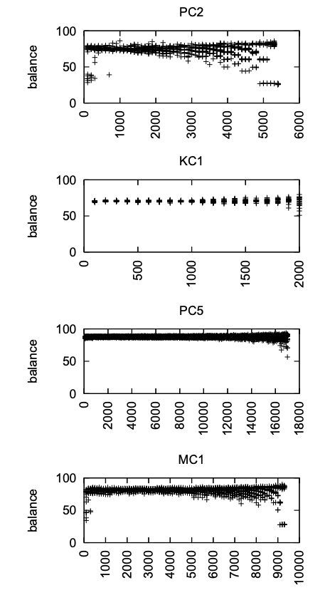

<a name=top> 
  
&nbsp;<a href="/README.md#top">home</a> ::
  <a href="/docs/syllabus.md#top">syllabus</a> ::
  <a href="https://docs.google.com/spreadsheets/d/16yxmklx4zvmfAHE7QocOQZZ4v4UxD5ktJHWMJEjBcMI/edit#gid=0">groups</a> ::
  <a href="/LICENSE.md#top">&copy;&nbsp;2024</a>, <a href="http:/timm.fyi">Tim Menzies</a> 
  

# How much data is enough?

## Standard line: more is better

- “The Unreasonable Effectiveness of Data,” by Google’s then Chief Scientist
  Peter Norvig 
  - “Billions of trivial data points can
    lead to understanding” [^norving11] (a claim he supports with numerous
    examples from vision research).
- In software analytics,  data-hungry researchers assume that if
  data is useful, then even more data is much more useful. For
  example:
  - “..as long as it is large; the resulting prediction performance is likely to be boosted more by the size of the
    sample than it is hindered by any bias polarity that may
    exist” [^rahman13].
  - “It is natural to think that a closer previous release
    has more similar characteristics and thus can help to
    train a more accurate defect prediction model. It is also
    natural to think that accumulating multiple releases can
    be beneficial because it represents the variability of a
    project” [^amasaki20].
  - “Long-term JIT models should be trained using a cache
    of plenty of changes” [^mcintosh17].

[^rahman13]: F. Rahman, D. Posnett, I. Herraiz, and P. Devanbu,
“Sample size vs.  bias in defect prediction,” in Proceedings of the
2013 9th joint meeting on foundations of software engineering. ACM,
2013, pp. 147–157.

[^amasaki20]: S. Amasaki, “Cross-version defect prediction: use
historical data, crossproject data, or both?” Empirical Software
Engineering, pp. 1–23, 2020.

[^mcintosh17]: S. McIntosh and Y. Kamei, “Are fix-inducing changes
a moving target?  a longitudinal case study of just-in-time defect
prediction,” IEEE Transactions on Software Engineering, vol. 44,
no. 5, pp. 412–428, 2017.

[^norvig11]: P. Norvig. (2011) The Unreasonable Effectiveness of
Data. Youtube.  https://www.youtube.com/watch?v=yvDCzhbjYWs

## A more informed position: The question is wrong

- It depends on the nature of the data
  - e.g. if i show you, one at a time, 100 "1"s then we are pretty sure the 101-th thing will be "1".
  - So if data clusters to regions with not much variance
    - then once we find those regions, we can stop
- And sometimes its not what the data is...
  - .. but when we collect it
  - Shrikanth and Menzies: the early bird hypothesis
    - data learned from the first 150 commits builds a 
      model as good as anything else [^majumder21];
    - data from the early in the lifecycle is richer in examples of things going wrong

[^majumder21]: S. N.C., S. Majumder and T. Menzies, 
"Early Life Cycle Software Defect Prediction. Why? How?," 2021 IEEE/ACM 43rd International Conference on Software Engineering (ICSE), Madrid, ES, 2021, pp. 448-459, doi: 10.1109/ICSE43902.2021.00050.

## Another question: How much data can you handle?

For very fast decision making, there is a cognitive science  case that we work
from less than a dozen examples:

- Larkin et al. [^larkin80] characterize human expertise in terms of very
small short term memory, or STM (used as a temporary scratch
pad for current observation) and a very large long term memory,
or LTM. The LTM holds separate tiny rule fragments that explore
the contents of STM to say “when you see THIS, do THAT”. When
an LTM rule triggers, its consequence can rewrite STM contents
which, in turn, can trigger other rules
- Short term memory is very small, perhaps even as small as four
to seven items [^cowan01] [^miller56].
Experts are experts, says Larkin et al. [^larkin80]
because the patterns in their LTM patterns dictate what to do,
without needing to pause for reflection. Novices perform worse
than experts, says Larkin et al., when they fill up their STM with
too many to-do’s where they plan to pause and reflect on what to
do next. Since, experts post far fewer to-do’s in their STMs, they
complete their tasks faster because (a) they are less encumbered
by excessive reflection and (b) there is more space in their STM
to reason about new information. While first proposed in 1981,
this STM/LTM theory still remains relevant [^mri]. This theory can
be used to explain both expert competency and incompetency in
software engineering tasks such as understanding code [^wiedenbeck93].

[^mri]: Recently, Ma et al. [^wei14] used evidence from neuroscience and functional MRIs to
argue that STM capacity might be better measured using other factors than “number of
items”. But even they conceded that “the concept of a limited (STM) has considerable
explanatory power for behavioral data”.

[^wei14]: Wei Ji Ma, Masud Husain, and Paul M Bays. 2014. Changing concepts of working
memory. Nature neuroscience 17, 3 (2014), 347–356.

[^wiedenbeck93]: Susan Wiedenbeck, Vikki Fix, and Jean Scholtz. 1993. Characteristics of the
mental representations of novice and expert programmers: an empirical study.
International Journal of Man-Machine Studies 39, 5 (1993), 793–812.

[^miller56]: George A Miller. 1956. The magical number seven, plus or minus two: some
limits on our capacity for processing information. Psychological review 63, 2
(1956), 81.

[^cowan01]: N. Cowan. 2001. The magical number 4 in short-term memory: a reconsideration
of mental storage capacity. Behav Brain Sci 24, 1 (Feb 2001), 87–114.

[^larkin80]: Jill Larkin, John McDermott, Dorothea P. Simon, and Herbert A. Simon. 1980.
Expert and Novice Performance in Solving Physics Problems. Science 208,
4450 (1980), 1335–1342. DOI:http://dx.doi.org/10.1126/science.208.4450.1335
arXiv:http://science.sciencemag.org/content/208/4450/1335.full.pdf

## Another question: How much data can you get?

How fast can we gather expert oppinion?

- Some can monitor products on an assembly line, 1000s of items per day
  - And there will be some error rate
- But suppose we have a panel of experts?
  - And suppose they have to check with everyone else before making a decision?
  - Then everything they conclude has to be analysed, certified

Evidence from "cost estimation"

- Valerdi [^valerdi10] reports that panels of human experts required 
  three meetings (three hours each) to reach convergence on the influence of 
  10 variables on 10 examples (in the domain of cost estimation). 

[^valerdi10]: Valerdi, Ricardo. "Heuristics for systems engineering cost estimation." IEEE Systems Journal 5.1 (2010): 91-98.

Evidence from "Repertory Grids"

- A structure interview technique, learn the dimensions incrementally as we go:
  1. Take three examples $E_1,E_2,E_3$: 
    - Which one is most distant?
    - Along what dimension $D_i$ is it distant?
    - Score those examples on this dimensions. 
  2. Goto to step 1.

Advice on how long to fill in a rep grid?

- Kington [^king90]:
  - One hour to walk thorugh $E=16$ examples with $D=16$ dimensions.
- Easterby-Smith [^easter80]:
  - Keep the grid small. 
  - A grid containing ten elements and ten constructs may take two hours to complete. 
  - Larger grids may take substantially more time
- Edwards's [^edwards09] rep grid interview sessions lasted, on average, for one hour 
  (although the shortest was 30 min) and these were recorded for later analysis.

[^edwards09]:  Helen M. Edwards, Sharon McDonald, S. Michelle Young,
The repertory grid technique: Its place in empirical software engineering research,
Information and Software Technology, Volume 51, Issue 4, 2009, Pages 785-798, ISSN 0950-5849,

[^king90]: Kington, Alison. "Defining Teachers' Classroom Relationships." (2009).  https://eprints.worc.ac.uk/1885/1/Kington%202009.pdf

[^easter80]: Easterby-Smith, Mark. “The Design, Analysis and Interpretation of 
Repertory Grids.” Int. J. Man Mach. Stud. 13 (1980): 3-24.

Overall, we get, for reflective labels on data:

- 10 to 20 examples per 1-4 hours

## Advice from Mathematics

One commonly cited rule of thumb [^call] is to have at least 10 times the number of training data 
instances attributes [^austin17] [^peduzzi96].

- by this rule, 20 attributes needs 200 rows

[^austin17]: Austin PC, Steyerberg EW. Events per variable (EPV) and the relative performance of different strategies for estimating the out-of-sample validity of logistic regression models. Stat Methods Med Res. 2017 Apr;26(2):796-808. doi: 10.1177/0962280214558972. Epub 2014 Nov 19. PMID: 25411322; PMCID: PMC5394463.

[^peduzzi96]: Peduzzi P, Concato J, Kemper E, Holford TR, Feinstein AR. A simulation study of the number of events per variable in logistic regression analysis. J Clin Epidemiol. 1996 Dec;49(12):1373-9. doi: 10.1016/s0895-4356(96)00236-3. PMID: 8970487.

## Historically, how much data was enough?

- Semi-supervised learning: $\sqrt{N}$ is enough
  - Alvarez [^alvarez23] recursively bi-cluster down to $\sqrt{N}$ then collect one
    data point per leaf cluster.

[^alvarez23]: Alvarez, L., & Menzies, T. (2023). Don’t Lie to Me: Avoiding Malicious Explanations With STEALTH. IEEE Software, 40(3), 43-53.

- Zhu et al. [^zhu16]
  - Numerous examples from facila recongition where face accuracy plateaus at $M> 100$ examples

- Incremental learning in SE: [^Me08]
  - Sort data on historical order;
  - Train up to time $t$, test of data after $t$.
  - Even with 1000s of examples
    - Learning on 25 defective examples + 25 non-defective
    - Did as good as anything else.

[^Me08]: Menzies, T., Turhan, B., Bener, A., Gay, G., Cukic, B., &
predictors. In Proceedings of the 4th international workshop on
Predictor models in software engineering (pp. 47-54).

[^zhu16]: Zhu, X., Vondrick, C., Fowlkes, C.C. et al. Do We Need More Training Data?. 
Int J Comput Vis 119, 76–92 (2016). https://doi-org.prox.lib.ncsu.edu/10.1007/s11263-015-0812-2

## Maths

### Chess board model

Data is spread out acoss a d-dimensional chessboard where each dimension
is divided into $b$ bins [^nam18].

- Data is skewed by some factor $k$ such that not all cells have data.
- a standard chess board is $d,b=2,8$

The target is some subset of the data that falls into some of the chessboard
cells:

- $c=b^{-d}$  is the probability of picking a particular cell; 
- $C=1-(1-p)^n$ is the certaintity  that once we arrive at a cells, 
  that we can find the signal after $n$ attempts
  (which occurs at probability $p$ in that cell)
- So lets do some simulations. 1,000 times pick at random from the following:  
  - $k \in \{ 1, 2, 3, 4, 5\}$
  - $d \in \{ 3, 4, 5, 6, 7\}$  dimensions;
  - $b \in \{ 2 , 3, 4, 5, 6, 7\}$ bins;
  - $p \in \{0.1, 0.2, 0,3, 0.4\}$
  - We gave the whole thing to a decision tree learner, asking what factors
    predicts for more than 67% chance of finding the target.
    - and the learnt tree told us:
      - We need up to 200 examples when the defect signal is rare ($p\le 10$ 
        percent)
      - But far fewer when the signal occurs at $p > 10$ percent.

### Probable Correctness Theory

Richard Hamlet, Proable correctness theory, 1980 [^hamlet80].

[^hamlet80]: Hamlet, Richard G. "Probable correctness theory." Information processing letters 25.1 (1987): 17-25.

- Confidence $C$ that we will see an event at probability $p$ after $n$ random trials:
  - $C(p,n) =1-(1-p)^n$
- Which re-arranges to:
  - $n(C,p) = \frac{\log(1-C)}{\log(1-p)}$
- And if we have a sorting trick to divide examples into _best_ and _rest_
  - then the number of evals is $\log_2(n(C,p))$

Some what ifs:
- If we apply Cohen's rule (things are indistinguishable if less than $d{\times}\sigma$ apart,
  - And if variables are Gaussian ranging $-3 \le x \le 3$.
  - Then that space divides into regions of size $p=\frac{d}{6}$  

scenario |d  | p | C |  n(c,p) | $\log_2(n(c,p))$
---------|---|---|---|---------|-----------------
medium effect, non-safety critical|0.35|0.06|0.95|50|6
small effect, safety criticali     |0.2   |0.03            |0.9999|272|8
tiny effects, ultra-safety critical | n/a | one in a million|six sigma  (0.999999)|13,815,504| 24

Note the above table makes some very optimistic assumptions about the problem:

- It is single variable gaussian
- Solutions are spaced equally across the x-axis

But it also tells us that the only way we can reason about safety critical systems
is via some sorting heuristic (so we can get the log2 effect)
[^call]:  Application of machine learning techniques in small sample clinical studies, 
from StackExchange.com
https://stats.stackexchange.com/questions/1856/application-of-machine-learning-techniques-in-small-sample-clinical-studies

[^nam18]: J. Nam, W. Fu, S. Kim, T. Menzies and L. Tan, "Heterogeneous Defect Prediction," in 
IEEE Transactions on Software Engineering, vol. 44, no. 9, pp. 874-896, 1 Sept. 2018, doi: 10.1109/TSE.2017.2720603.

## In summary

What | N
----:|-------
Standard theory: |  more is always better
Cognitive Science: | 7 plus or minus 2
From human studies (cost estimation, rep grids) : |  10 to 20 examples per 1-4 hours
Regression theory| 10 examples per attribute
Semi-supervised learning | $\sqrt{N}$
Zhu et al. [^zhu16] | 100 images
Menzies et al. 2008 [^Me08] | 50 examples
Chessboard model    | 200 exmples
Probable Correctness theory | simpler cases: 50 to 6 (if we can binary chop)  safety-critical cases: 272 to 8 (if we can binary chop)<
 
