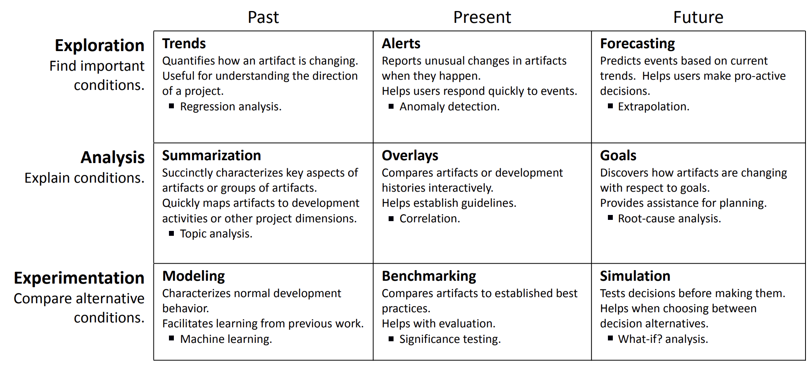

<a name=top> 
  
&nbsp;<a href="/README.md#top">home</a> ::
  <a href="/docs/syllabus.md#top">syllabus</a> ::
  <a href="https://docs.google.com/spreadsheets/d/16yxmklx4zvmfAHE7QocOQZZ4v4UxD5ktJHWMJEjBcMI/edit#gid=0">groups</a> ::
  <a href="/LICENSE.md#top">&copy;&nbsp;2024</a>, <a href="http:/timm.fyi">Tim Menzies</a> 
  

# Applications of "Explanation"

Previosly it was argued that "explanation is everything". In support of this:

- Here  I define an explanation algorithm
- THen I show how many other tasks can be accomplished with the same architecture as explanation generation.

## RRP is Everything?

Given data divided recursively into a tree with leaf clusters $C_1, C_2,...$, suppose we can guess (or look up) labels $L(C_i)$  for each cluster:

- E.g. all those labels are actually available;
- E.g. those labels were geneated via RRL (so the clusters are numbered left to right, best to worst, 1,2,3,4...);
- E.g. for a small  random sample  per leaf, you actually look up the labels.

Each cluster $C_i$ has a delta $\delta = C_i - Ci$ to another cluster $C_j$. That delta can be measured many ways including:

- E.g. Differences between the cluster centroids (ignoring any deltas that are not statistically significant);
- E.g. the edge distance in the cluster tree (so siblings have a distance of 2).

Then:

|cite|  |Task| Implementation|
|-|--|----|----------------|
|||Localization | take current example, walk it down the cluster tree to find its relevant leaf|
| [^peters15] ||Anomaly detection|Anomalous if you are far away from everything else in your relevant leaf|
|||Certification| Warn if any new example is anomalous.  For efficient certification, use compression (see below).|
|||Streaming| (a) Collect the anomalies at their nearest cluster;   (b) If more than $N$ anomalies, rebuild clusters from that point downwards|
|||Classification | Localization + report mode class label in relevant leaf|
|||Regression | Localization + report median class label in relevant leaf|
|||Pollution marking|(a) Measure the variance or the inaccuracies of predictions at each leaf.  (b) Starting at the leaves and working up the tree, delete any node that is too variable or inaccurate.|
|||Compression| Report whole contrast tree as just the two distant points (at each level) and the median point (where you cut the data, left right)|
|[^chen19]||Optimization| see planning. Note that this kind of planning does not need $O(N)$ evals but just the $O(2{\times}log(N))$  evals needed for the optimization|
|[^chen19] [^lustosa23]||Hyperparameter optimization (see optimziation)|
|||Configuration| see optimization, but seek good configs with very few samples|
|||Envy| (a) Localization to find $C_i$.   (b) Find other leaves $C_j$ where $L(C_j) > L(C_i)$ |
|||Fear| (a) Localization to find $C_i$.   (b) Find other leaves $C_j$ where $L(C_j) < L(C_i)$ |
|||Contrast| Find the delta between two leaf clusters $C_i$, $C_j$|
|||Explain| Report contrasts $C_i$ to $C_j$ as human readable rules|
|||Planning| Explanation of contrasts to thing you envy|  
||Maximal|Planning| Planning to the thing you envy the most|  
||Minimal|Planning| Planning that maximizes improvement while  minimizing the change from $C_i$ to $C_j$|
|||Monitoring| Explanation of contrasts to thing you fear|  
||Maximal|Monitoring| Monitoring  to the thing you fear the most|  
||Minimal|Monitoring| Monitoring that maximizes loss while minimizing  the change  from $C_i$ to $C_j$|
|||Data Synthesis| Generate examples by interpolating between items in each cluster|
|||Privatization| Use data synthesis, favoring regions close to other examples (so you can't distinguish new from old)|
| [^peters15] |Compressed|Privatization| Only share compressed data (so the data not in the compression is 100% private)|
| [^peters15] ||Sharing| (a) Pass around the compressed private data to each stakeholder. (b) Each stakeholder only adds in their local data that is anomalous (i.e. do not add in things that are already there)|
| [^peters15] ||Transfer Learning| After sharing, data from N sources will be all mixed up in the contrast tree (in different leaves). Your local data can then transfer knowledge from other sites by localizing into that space.|

[^lustosa23]: Andre Lustosa and Tim Menzies. 2023. Learning from Very Little Data: On the Value of Landscape Analysis for Predicting Software Project Health. ACM Trans. Softw. Eng. Methodol. Just Accepted (November 2023). https://doi.org/10.1145/3630252

[^chen19]: J. Chen, V. Nair, R. Krishna and T. Menzies, "“Sampling” as a Baseline Optimizer for Search-Based Software Engineering," in IEEE Transactions on Software Engineering, vol. 45, no. 6, pp. 597-614, 1 June 2019, doi: 10.1109/TSE.2018.2790925.

[^peters15]: F. Peters, T. Menzies and L. Layman, "LACE2: Better Privacy-Preserving Data Sharing for Cross Project Defect Prediction," 2015 IEEE/ACM 37th IEEE International Conference on Software Engineering, Florence, Italy, 2015, pp. 801-811, doi: 10.1109/ICSE.2015.92.

## SMO is Everything?
Can the above be adapted to SMO? Perhaps. 

- If we used the `best` and `rest` models to select groups of $C_i$ (good examples) and $C_j$ (bad examples);
- How much of the previous section could be repeated?

## Open Issues

What about other tasks? Is there a list somewhere of all the tasks people want to achieve? 

Well, yes. See Buse and Zimmermann [^buse12].

[^buse12]: Raymond P. L. Buse and Thomas Zimmermann. 2012. Information needs for software development analytics. In Proceedings of the 34th International Conference on Software Engineering (ICSE '12). IEEE Press, 987–996.

